#PS Entire thing scrapped and redone in new repo.

List of all [commands](Broomburg/commands.txt)
- Uses a tkinter interface (ew).  
- Raw: able to pull live price and fundamental data via yahooquerry and news via RSS feeds.  
- Processed: relative valuation (factors), auto populate data necessary for dcf onto xlsx file, basic vol calculations, bad attempts at MATCH interface for screening and shell interface. Prob missed some stuff.  

# EDA
#PS Very, very small sample size to speed up run time of tests.
Reason is this is just a proof of concept, not meant to be statistically significant. 

HML3
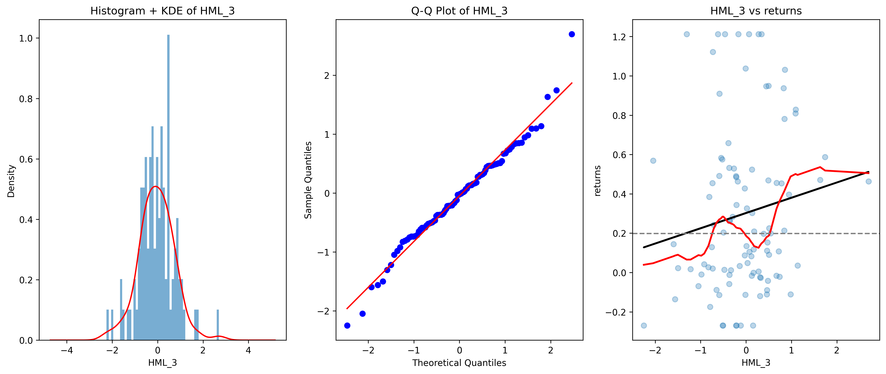

Sector
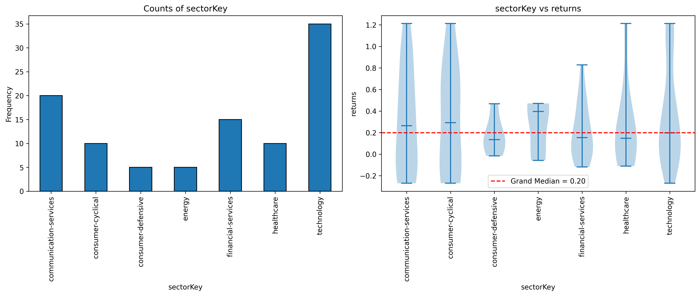

# OLS Inference
Linearity, Homoscedasticity, Independence and Normality of Errors
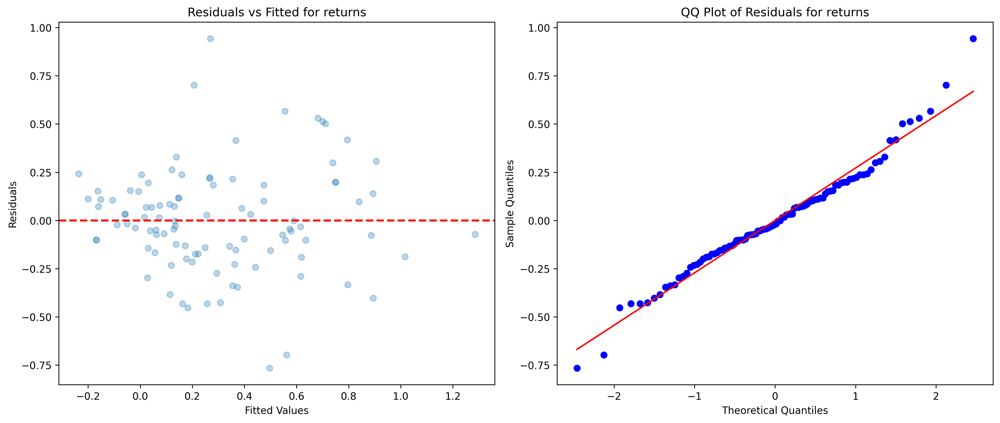

Leverage and Multicollinearity
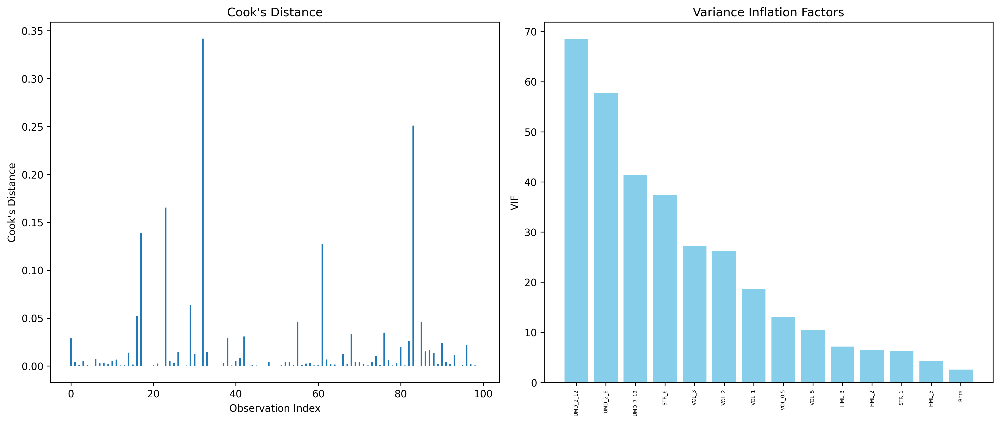

# XGB
Learning Curve
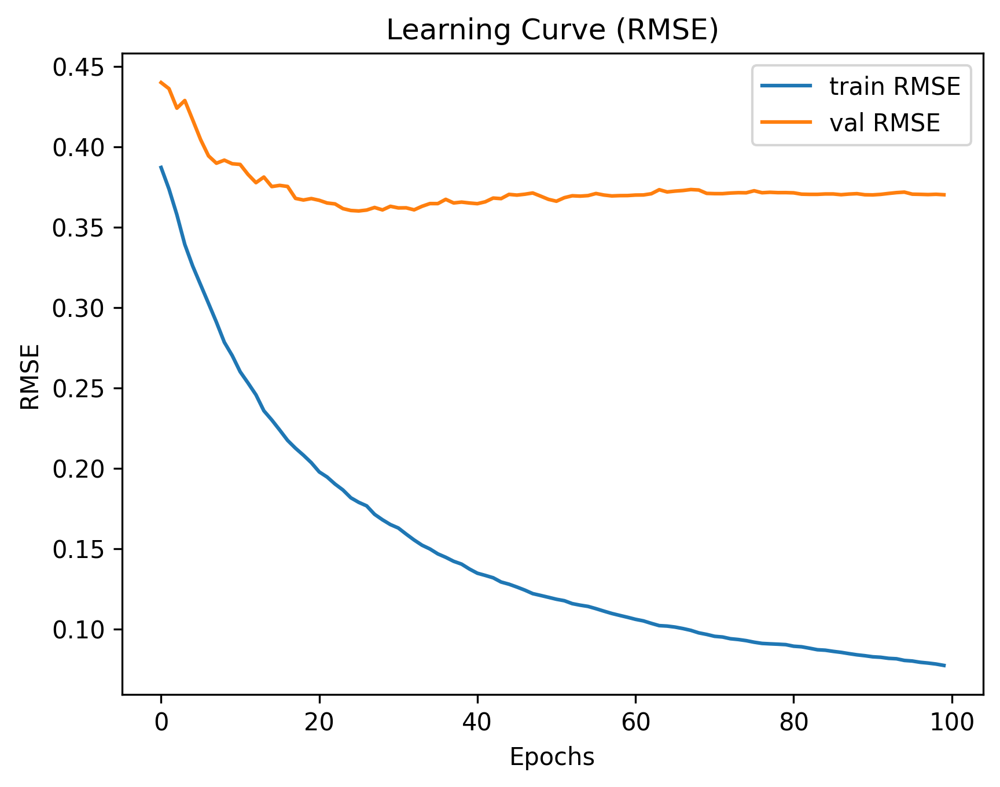

Dependency
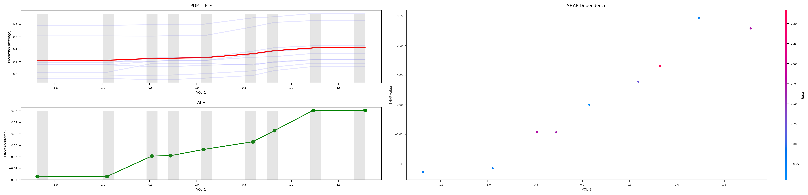

Explanation
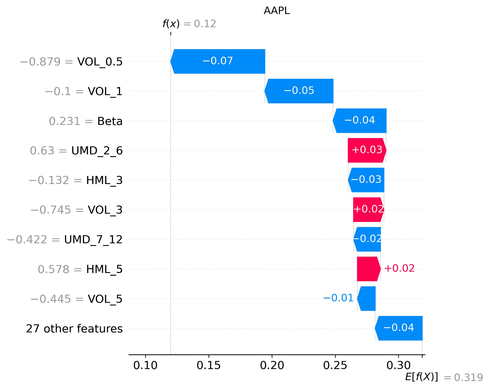

# Random Forest
SHAP
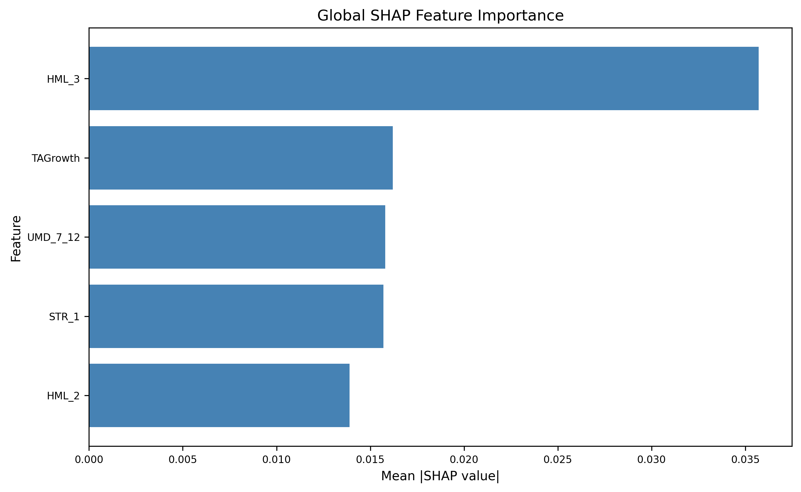

# PCA
Scree + CEV
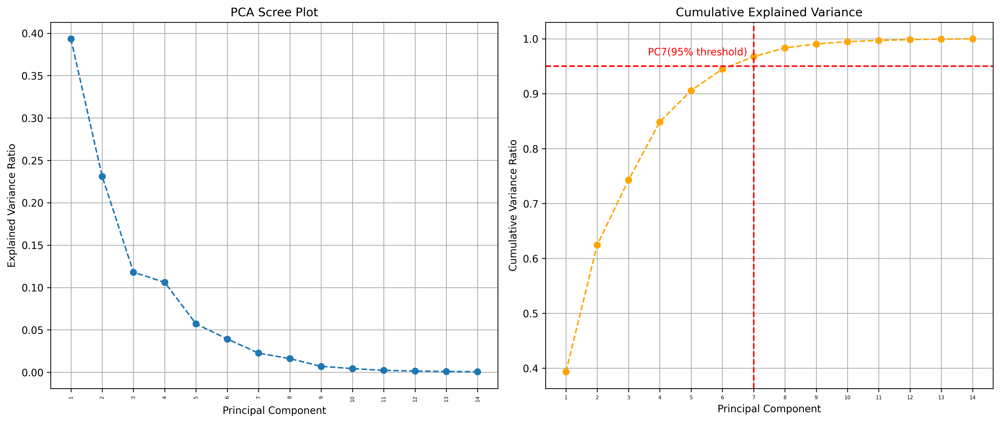

Loadings
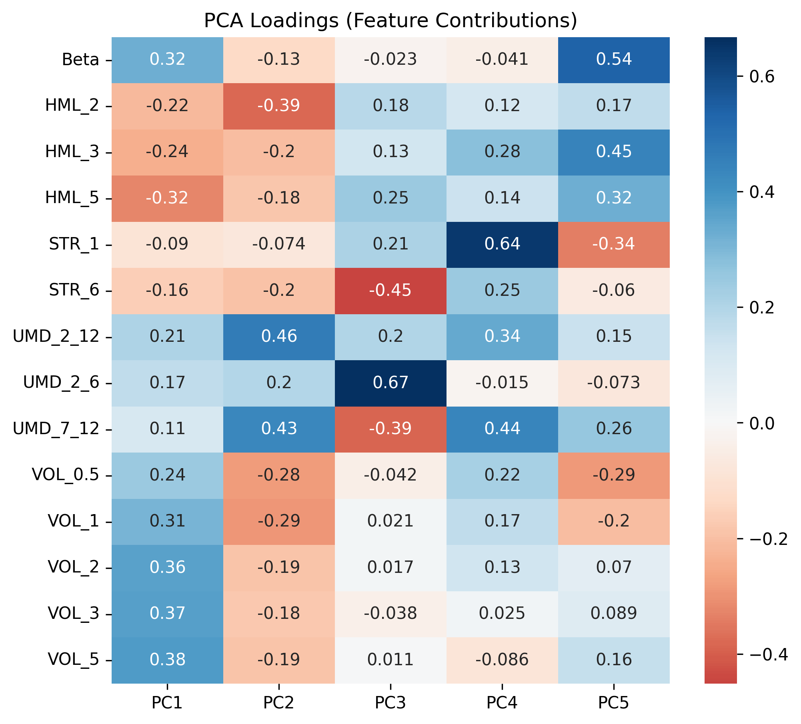

# Corr
Returns
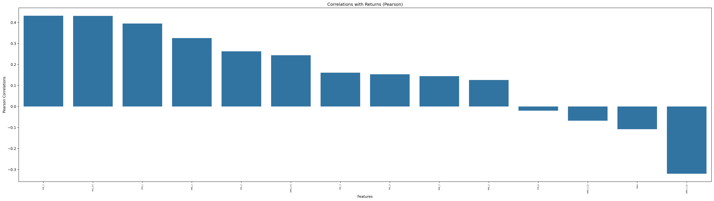

